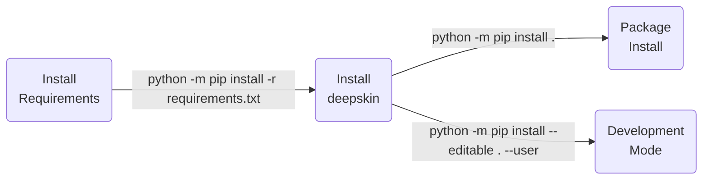

<p align="center">
  
  <br>
</p>

| **Authors**  | **Project** |  **Documentation** | **Build Status** | **License** |
|:------------:|:-----------:|:------------------:|:----------------:|:-----------:|
| [**N. Curti**](https://github.com/Nico-Curti) | **deepskin**<br>[](https://www.mdpi.com/1422-0067/24/1/706) | [](https://deepskin.readthedocs.io/en/latest/?badge=latest)<br>[](https://github.com/Nico-Curti/Deepskin/actions/workflows/docs.yml) | [](https://github.com/Nico-Curti/Deepskin/actions/workflows/python.yml) | [](https://github.com/Nico-Curti/Deepskin/blob/main/LICENSE) |

[](https://github.com/Nico-Curti/Deepskin/pulls)
[](https://github.com/Nico-Curti/Deepskin/issues)

[](https://github.com/Nico-Curti/Deepskin/stargazers)
[](https://github.com/Nico-Curti/Deepskin/watchers)

<a href="https://github.com/UniboDIFABiophysics">
  <div class="image">
    
  </div>
</a>

# Deepskin

## Wound analysis using smartphone images

Official implementation of the deepskin algorithm published on [International Journal of Molecular Science](https://www.mdpi.com/1422-0067/24/1/706) by Curti et al. [](https://www.mdpi.com/1422-0067/24/1/706) and used in [](https://link.springer.com/article/10.1007/s10916-023-02029-9)

* [Overview](#overview)
* [Prerequisites](#prerequisites)
* [Installation](#installation)
* [Usage](#usage)
* [Table of contents](#table-of-contents)
* [Contribution](#contribution)
* [References](#references)
* [FAQ](#faq)
* [Authors](#authors)
* [License](#license)
* [Acknowledgment](#acknowledgment)
* [Citation](#citation)

### :tada: Important updates :tada:

With the new version of the Deepskin dataset, we improved the segmentation model providing the possibility to perform a multi-class semantic segmentation!
Using the `deepskin` package you can directly use the latest version of the model, obtaining for each image a semantic segmentation according to the following classes:

*  wound ROI
*  patient body ROI
*  background ROI

## Overview

The `deepskin` package aims to propose a fully automated pipeline for the wound-image processing

The first step of the `deepskin` pipeline involves the automated identification of the wound ROI in the image.
This task is address using a deep learning U-Net model trained on a large set of images.
The model training was performed using an active semi-supervised learning strategy (ASSL), given by the following step of processing:

1. The images acquired using a smartphone were stored into the training dataset.
2. Starting with a small set of annotated images (not included into the scheme), we trained from scratch a neural network model for the wound segmentation.
3. All of the unlabeled images were used as validation set, and the generated masks were provided by the expert.
4. The expert analyzed the produced segmentation according to a predetermined evaluation criterion.
5. The masks which satisfied the criteria would be added as ground truth for the next round of training.

The ASSL module was developed using the [active_learning_validator](https://github.com/Nico-Curti/active_learning_validator) software.

Using the obtained segmentation mask, we developed a second step of processing for the automated estimation of the PWAT score from the image.
This second workflow of analysis is described by the scheme proposed in the **Figure 1**.

|  |
| -- |
| **Figure 1.** *Schematic representation of the pipeline. The image is acquired by the smartphone (Deepskin dataset) during clinical practice. Two expert clinicians performed the manual annotation of the PWAT score associated to each wound, considering the status of the lesion and peri-lesion areas. The neural network model trained on the Deepskin dataset performs the automated segmentation of the wound area. Focusing on the wound and peri-wound areas (obtained by image processing analyses), a set of features for the quantification of textures and morphology of the lesion are extracted. A regression model based on the features extracted from the images is tuned for the automated prediction of the PWAT scores. While Step 1 and Step 2 requires the human intervention, by definition, the second half of the pipeline automatically performed the analysis. We would like to stress that the first two steps are mandatory for the training of the automated solution but are discarded during real clinical applications.* |

Since there is not a standardized set of criteria for the wound area definition, its reliability is left to the clinical needs.
Several sub-items of the PWAT score involves the peri-wound area (e.g. Peri-ulcer Skin Viability and Edges items), which is excluded by our segmentation mask.
we implemented a second step of automated image processing for the identification of the peri-wound areas, starting from the segmentation masks generated by our model.
Using a combination of erosion and morphological dilation operators, keeping fixed the size of the structuring element (kernel) involved, we extracted for each image the associated peri-wound mask.
An example of the resulting processing is showed in the **Figure 2**.

|  |
| -- |
| **Figure 2.** *Example of segmentation masks used for wound identification. (a) Raw image extracted from Deepskin dataset. (b) Wound segmentation mask generated by automated neural network model. (c) Peri-wound segmentation mask obtained applying morphological operators on wound mask.* |

The quantification of the items related to the PWAT estimation involves both the wound and peri-wound areas.
Since only 1/8 of PWAT sub-items involves the peri-wound area, we independently performed the features extraction on both the ROIs.
In this way, we aimed to maximize the informative power of the features extracted from the wound area, minimizing the putative confounders, but preserving the information related to the peri-wound area.
A set of fully interpretable features will be extracted from the wound and peri-wound ROIs, and given as input for a regression model trained on a large dataset of annotated samples.
The resulting regression model is able to determine the PWAT score of the wound, as showed in the **Figure 3**.

|  |
| -- |
| **Figure 3.** *Example of the predictions obtained by the regression model on three test images. We report the assigned PWAT score and the predicted one for each image using our model. We highlighted the wound areas identified by our automated segmentation model with the green lines.* |

The proposed regression model could provide PWAT predictions with a continuous range of values, i.e. floating-point scores.
The possibility to describe the wound severity using a finer-grained scale could provide a better patients stratification while preserving the same informative power as the original PWAT scale.

## Prerequisites

The complete list of requirements for the `deepskin` package is reported in the [requirements.txt](https://github.com/Nico-Curti/Deepskin/blob/main/requirements.txt)

## Installation

Python version supported : 

The `Python` installation is executed using [`setup.py`](https://github.com/Nico-Curti/Deepskin/blob/main/setup.py) script.



## Usage

You can use the `deepskin` library into your Python scripts or directly via command line.

### Command Line Interface

The `deepskin` package could be easily used via command line (after installing the library!) by simply calling the `deepskin` program.

The full list of available flags for the customization of the command line could be obtained by calling:

```bash
$ deepskin --help
usage: deepskin [-h] [--version] [--input FILEPATH] [--verbose] [--mask] [--pwat]

deepskin library - Wound analysis using smartphone images

optional arguments:
  -h, --help            show this help message and exit
  --version, -v         Get the current version installed
  --input FILEPATH, -i FILEPATH
                        Input filename or path on which load the image. Ref
                        https://docs.opencv.org/4.x/d4/da8/group__imgcodecs.html for the list of supported formats.
  --verbose, -w         Enable/Disable the code logging
  --mask, -m            Evaluate the semantic segmentation mask using the Deepskin model; the resulting mask will be
                        saved to a png file in the same location of the input file
  --pwat, -p            Compute the PWAT score of the given wound-image

Deepskin Python package v0.0.1
```

### Python script

A complete list of beginner-examples for the build of a custom `deepskin` pipeline could be found [here](https://github.com/Nico-Curti/Deepskin/blob/main/docs/source/notebooks).

For sake of completeness, a simple `deepskin` pipeline could be obtained by the following snippet:

```python
from deepskin import wound_segmentation
from deepskin import evaluate_PWAT_score

# load the image in any OpenCV supported fmt
bgr = cv2.imread('/path/to/picture.png')
# convert the image from BGR to RGB fmt
rgb = bgr[..., ::-1]
# get the wound segmentation mask
wound_mask = wound_segmentation(img=rgb)
# compute the wound PWAT
pwat = evaluate_PWAT_score(img=rgb, wound_mask=wound_mask)
# display the results
print(f'PWAT score: {pwat:.3f}')
```

## Table of contents

Description of the folders related to the project

| **Directory**                                                                        |  **Description**                                                             |
|:-------------------------------------------------------------------------------------|:-----------------------------------------------------------------------------|
| [notebook](https://github.com/Nico-Curti/Deepskin/blob/main/docs/source/notebooks)   | `Jupyter` notebook with some examples of image processing tasks.             |
| [deepskin](https://github.com/Nico-Curti/Deepskin/blob/main/deepskin)                | List of `Python` scripts for image processing and features extraction.       |

## Contribution

Any contribution is more than welcome :heart:. Just fill an [issue](https://github.com/Nico-Curti/Deepskin/blob/main/.github/ISSUE_TEMPLATE/ISSUE_TEMPLATE.md) or a [pull request](https://github.com/Nico-Curti/Deepskin/blob/main/.github/PULL_REQUEST_TEMPLATE/PULL_REQUEST_TEMPLATE.md) and we will check ASAP!

See [here](https://github.com/Nico-Curti/Deepskin/blob/main/.github/CONTRIBUTING.md) for further informations about how to contribute with this project.

## References

<blockquote>1. Curti N, Merli Y, Zengarini C, Giampieri E, Merlotti A, Dall’Olio D, Marcelli E, Bianchi T, Castellani G. Effectiveness of Semi-Supervised Active Learning in Automated Wound Image Segmentation. International Journal of Molecular Sciences. 2023; 24(1):706. https://doi.org/10.3390/ijms24010706 </blockquote>

<blockquote>2. Buschi D, Curti N, Cola V, Carlini G, Sala C, Dall’Olio D, Castellani G, Pizzi E, Del Magno S, Foglia A, et al. Automated Wound Image Segmentation: Transfer Learning from Human to Pet via Active Semi-Supervised Learning. Animals. 2023; 13(6):956. https://doi.org/10.3390/ani13060956 </blockquote>

<blockquote>3. Amparo F, Wang H, Emami-Naeini P, Karimian P, Dana R. The Ocular Redness Index: a novel automated method for measuring ocular injection. Invest Ophthalmol Vis Sci. 2013 Jul 18;54(7):4821-6. doi: 10.1167/iovs.13-12217. PMID: 23766472; PMCID: PMC3720148. </blockquote>

<blockquote>4. Park IK, Chun YS, Kim KG, Yang HK, Hwang JM. New clinical grading scales and objective measurement for conjunctival injection. Invest Ophthalmol Vis Sci. 2013 Aug 5;54(8):5249-57. doi: 10.1167/iovs.12-10678. PMID: 23833063. </blockquote>

<blockquote>5. Curti N, Giampieri E, Guaraldi F, Bernabei F, Cercenelli L, Castellani G, Versura P, Marcelli E. A Fully Automated Pipeline for a Robust Conjunctival Hyperemia Estimation. Applied Sciences. 2021; 11(7):2978. https://doi.org/10.3390/app11072978. </blockquote>

## FAQ

* <details>
    <summary>
      <b>
        I'm working with tensorflow `v2.16.1` (or later) and the model produces incorrect segmentations
      </b>
    </summary>
    <p>

    If you are working with `tensorflow` versions higher than `2.16.1`, the default Keras version used by the model is `Keras 3`, as indicated in the release documentation (ref. [here](https://blog.tensorflow.org/2024/03/whats-new-in-tensorflow-216.html)).
    The original deepskin model was trained with lower versions of `tensorflow` (and, therefore, with lower version of `Keras`).
    Therefore, there could be problems related to backward compatibility of packages which can lead to very strange segmentation results: an example is reported and discussed in the [issue](https://github.com/Nico-Curti/Deepskin/issues/2) which reported this error.
    A possible solution to solve this issue is to force the use of the legacy version of Keras, adding an extra line at the **beginning** of your scripts:

    ```python
    import os
    os.environ['TF_USE_LEGACY_KERAS'] = '1'
    from deepskin import wound_segmentation
    ```

    This way, before importing tensorflow package via the deepskin module, the environment variable sets the version of Keras to be used by the model.

    **NOTE:** Newer versions of tensorflow are optimized to use the latest versions of Keras, so there may be a loss of efficiency during the prediction!

    **NOTE 2:** Incorrect segmentation could be obtained even with images very far from the data used during the model training, so the Keras version couldn't be the answer to all your problems...

    </p>
  </details>

:construction: **WORK IN PROGRESS** :construction:

## Authors

*  [](https://github.com/Nico-Curti), [](https://www.unibo.it/sitoweb/nico.curti2) **Nico Curti**
*  [](https://github.com/EnricoGiampieri), [](https://www.unibo.it/sitoweb/enrico.giampieri) **Enrico Giampieri**
*  [](https://github.com/GianlucaCarlini) [](https://www.unibo.it/sitoweb/gianluca.carlini3) **Gianluca Carlini**

See also the list of [contributors](https://github.com/Nico-Curti/Deepskin/contributors) [](https://github.com/Nico-Curti/Deepskin/graphs/contributors/) who participated in this project.

## License

The `deepskin` package is licensed under the MIT "Expat" License. [](https://github.com/Nico-Curti/Deepskin/blob/main/LICENSE)

### Acknowledgment

Thanks goes to all contributors of this project.

### Citation

If you have found `deepskin` helpful in your research, please consider citing the original paper about the wound image segmentation

```BibTex
@article{ijms24010706,
  author = {Curti, Nico and Merli, Yuri and Zengarini, Corrado and Giampieri, Enrico and Merlotti, Alessandra and Dall'Olio, Daniele and Marcelli, Emanuela and Bianchi, Tommaso and Castellani, Gastone},
  title = {Effectiveness of Semi-Supervised Active Learning in Automated Wound Image Segmentation},
  journal = {International Journal of Molecular Sciences},
  volume = {24},
  year = {2023},
  number = {1},
  article-number = {706},
  url = {https://www.mdpi.com/1422-0067/24/1/706},
  pubmedid = {36614147},
  issn = {1422-0067},
  abstract = {Appropriate wound management shortens the healing times and reduces the management costs, benefiting the patient in physical terms and potentially reducing the healthcare system&rsquo;s economic burden. Among the instrumental measurement methods, the image analysis of a wound area is becoming one of the cornerstones of chronic ulcer management. Our study aim is to develop a solid AI method based on a convolutional neural network to segment the wounds efficiently to make the work of the physician more efficient, and subsequently, to lay the foundations for the further development of more in-depth analyses of ulcer characteristics. In this work, we introduce a fully automated model for identifying and segmenting wound areas which can completely automatize the clinical wound severity assessment starting from images acquired from smartphones. This method is based on an active semi-supervised learning training of a convolutional neural network model. In our work, we tested the robustness of our method against a wide range of natural images acquired in different light conditions and image expositions. We collected the images using an ad hoc developed app and saved them in a database which we then used for AI training. We then tested different CNN architectures to develop a balanced model, which we finally validated with a public dataset. We used a dataset of images acquired during clinical practice and built an annotated wound image dataset consisting of 1564 ulcer images from 474 patients. Only a small part of this large amount of data was manually annotated by experts (ground truth). A multi-step, active, semi-supervised training procedure was applied to improve the segmentation performances of the model. The developed training strategy mimics a continuous learning approach and provides a viable alternative for further medical applications. We tested the efficiency of our model against other public datasets, proving its robustness. The efficiency of the transfer learning showed that after less than 50 epochs, the model achieved a stable DSC that was greater than 0.95. The proposed active semi-supervised learning strategy could allow us to obtain an efficient segmentation method, thereby facilitating the work of the clinician by reducing their working times to achieve the measurements. Finally, the robustness of our pipeline confirms its possible usage in clinical practice as a reliable decision support system for clinicians.},
  doi = {10.3390/ijms24010706}
}
```

or the related work about automated PWAT estimation

```BibTex
@article{Curti2024,
  author = {Curti, Nico and Merli, Yuri and Zengarini, Corrado and Starace, Michela and Rapparini, Luca and Marcelli, Emanuela and Carlini, Gianluca and Buschi, Daniele and Castellani, Gastone C. and Piraccini, Bianca Maria and Bianchi, Tommaso and Giampieri, Enrico},
  title = {Automated Prediction of Photographic Wound Assessment Tool in Chronic Wound Images},
  journal = {Journal of Medical Systems},
  year = {2024},
  month = {Jan},
  day = {16},
  volume = {48},
  number = {1},
  pages = {14},
  abstract = {Many automated approaches have been proposed in literature to quantify clinically relevant wound features based on image processing analysis, aiming at removing human subjectivity and accelerate clinical practice. In this work we present a fully automated image processing pipeline leveraging deep learning and a large wound segmentation dataset to perform wound detection and following prediction of the Photographic Wound Assessment Tool (PWAT), automatizing the clinical judgement of the adequate wound healing. Starting from images acquired by smartphone cameras, a series of textural and morphological features are extracted from the wound areas, aiming to mimic the typical clinical considerations for wound assessment. The resulting extracted features can be easily interpreted by the clinician and allow a quantitative estimation of the PWAT scores. The features extracted from the region-of-interests detected by our pre-trained neural network model correctly predict the PWAT scale values with a Spearman's correlation coefficient of 0.85 on a set of unseen images. The obtained results agree with the current state-of-the-art and provide a benchmark for future artificial intelligence applications in this research field.},
  issn = {1573-689X},
  doi = {10.1007/s10916-023-02029-9},
  url = {https://doi.org/10.1007/s10916-023-02029-9}
}
```

or the related work about the transfer learning on pet-wound images

```BibTex
@article{ani13060956,
  author = {Buschi, Daniele and Curti, Nico and Cola, Veronica and Carlini, Gianluca and Sala, Claudia and Dall’Olio, Daniele and Castellani, Gastone and Pizzi, Elisa and Del Magno, Sara and Foglia, Armando and Giunti, Massimo and Pisoni, Luciano and Giampieri, Enrico},
  title = {Automated Wound Image Segmentation: Transfer Learning from Human to Pet via Active Semi-Supervised Learning},
  journal = {Animals},
  volume = {13},
  year = {2023},
  number = {6},
  article-NUMBER = {956},
  url = {https://www.mdpi.com/2076-2615/13/6/956},
  pubmedid = {36978498},
  issn = {2076-2615},
  abstract = {Wound management is a fundamental task in standard clinical practice. Automated solutions already exist for humans, but there is a lack of applications regarding wound management for pets. Precise and efficient wound assessment is helpful to improve diagnosis and to increase the effectiveness of treatment plans for chronic wounds. In this work, we introduced a novel pipeline for the segmentation of pet wound images. Starting from a model pre-trained on human-based wound images, we applied a combination of transfer learning (TL) and active semi-supervised learning (ASSL) to automatically label a large dataset. Additionally, we provided a guideline for future applications of TL+ASSL training strategy on image datasets. We compared the effectiveness of the proposed training strategy, monitoring the performance of an EfficientNet-b3 U-Net model against the lighter solution provided by a MobileNet-v2 U-Net model. We obtained 80% of correctly segmented images after five rounds of ASSL training. The EfficientNet-b3 U-Net model significantly outperformed the MobileNet-v2 one. We proved that the number of available samples is a key factor for the correct usage of ASSL training. The proposed approach is a viable solution to reduce the time required for the generation of a segmentation dataset.},
  doi = {10.3390/ani13060956}
}
```

or just this repository

```BibTex
@misc{deepskin,
  author = {Curti, Nico},
  title = {{deepskin pipeline}: Wound analysis using smartphone images},
  year = {2023},
  url = {https://github.com/Nico-Curti/Deepskin},
  publisher = {GitHub},
  howpublished = {\url{https://github.com/Nico-Curti/Deepskin}}
}
```
